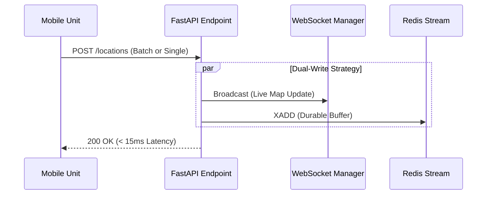

# Real-time Ingestion API (The Producer)

The **Backend API** acts as the high-speed gateway for all patrol telemetry. Unlike traditional CRUD APIs that write directly to a database (blocking the client), Sentinel uses an **Event-Driven Producer Pattern** to acknowledge requests in milliseconds while offloading persistence to background workers.

## 1. Architectural Role

The API has two critical responsibilities that must happen in **soft real-time**:
1.  **Ingest:** Accept location payloads from mobile devices immediately.
2.  **Broadcast:** Push live updates to the Command Dashboard via WebSockets.

### The Ingestion Flow

## 2. The `/locations` Endpoint Strategy
The core of the ingestion layer is a unified endpoint designed to handle the idiosyncrasies of mobile network connectivity (e.g., batching data when offline and flushing when online).

### A. Payload Normalization
Mobile SDKs (like Transistorsoft) often switch dynamically between sending single location pings and batched arrays depending on network health.

*   **Logic:** The endpoint inspects the `raw_payload`. If it's a list, it processes it as a batch; if it's a dict, it wraps it in a list. This ensures downstream logic remains identical regardless of the input format.

### B. The "Fire-and-Forget" Persistence
To maintain high throughput (1000+ requests/sec), the API **does not** write to MongoDB. Instead, it pushes data to a **Redis Stream**.

*   **Redis Pipelining:** We use a `redis_client.pipeline()` to group multiple `XADD` commands into a single network packet to the Redis server, significantly reducing TCP overhead for large batches.

### C. Live Dashboard Broadcasting
While the data is being queued for storage, it is *simultaneously* broadcast to the Command Center via WebSockets.

*   **Why:** This allows dispatchers to see patrol movements instantly (sub-second latency) without waiting for the database commit cycle.
## 3. Implementation Logic

### The Universal Ingestor
```python
@router.post("/locations")
async def receive_any_location_payload(request: Request):
    # 1. Normalize Payload (Batch vs Single)
    raw_payload = await request.json()
    locations = raw_payload.get('location', [])
    if not isinstance(locations, list):
        locations = [locations]

    # 2. Redis Pipeline Setup
    pipe = redis_client.pipeline()
    
    for loc in locations:
        # 3. WebSocket Broadcast (Instant Visual)
        await manager.broadcast(
            json.dumps({'lat': loc['coords']['latitude'], 'lng': loc['coords']['longitude']}), 
            raw_payload['patrol_id']
        )

        # 4. Stream Injection (Durable Storage)
        stream_payload = {
            'patrol_id': raw_payload.get('patrol_id'),
            'coords': [loc['coords']['longitude'], loc['coords']['latitude']],
            'status': raw_payload.get('patrol_status', 'unknown')
        }
        pipe.xadd(STREAM_NAME, {"location_data": json.dumps(stream_payload)})
    
    # 5. Execute Pipeline & Ack
    pipe.execute()
    return {"status": "ok"}
```
## 4. Redis Configuration (Senior Decisions)
The Redis client is configured with specific parameters to support high-velocity streaming.

*   **`decode_responses=True`**: Eliminates the overhead of manual byte-decoding in Python code.
*   **Connection Pooling:** (Implicit in `redis-py`) Ensures that the high volume of API requests reuses existing TCP connections to the Redis instance rather than opening/closing a socket for every ping.
## 5. Performance Metrics

| Metric | Value | Why it matters |
| :--- | :--- | :--- |
| **Response Time** | **< 15ms** | Prevents mobile app "lag" or battery drain from waiting on the server. |
| **Throughput** | **5k+ req/sec** | Scalable horizontal design (FastAPI + Uvicorn workers). |
| **Durability** | **High** | Redis Streams persist data to disk (AOF/RDB) preventing loss even if the Worker crashes. |