# The Route Generation Engine

The **Route Generation Engine** is the core decision-making service in the Sentinel platform. It transforms a simple list of "hotspots" selected by a Station House Officer (SHO) into an optimized, time-aware patrol route.

## 1. Architectural Role
This engine acts as a specialized **Geospatial Solver**. It takes operational constraints (time, location, priority) and uses a proprietary algorithm to generate the most efficient path for a patrol unit.

```mermaid
%%{
  init: {
    'theme': 'base',
    'themeVariables': {
      'primaryColor': '#1e1e1e',
      'primaryTextColor': '#e0e0e0',
      'primaryBorderColor': '#444',
      'lineColor': '#a9b7c6',
      'secondaryColor': '#2d2d2d',
      'tertiaryColor': '#2d2d2d'
    }
  }
}%%
flowchart TD
    %% --- DEFINE NODES ---
    A([🌐 <b>API Request</b>]):::start_end
    B{<b style='color:#ffb74d'>Auto-Visit Pending?</b>}:::decision
    
    C(💾 <b>1. Find Closest Unvisited</b><br/><i style='font-size:12px; color:#aaa'>Single SQL Query with JOIN & earth_distance</i>):::db_call
    
    D(💾 <b>2. Fetch Details</b><br/><i style='font-size:12px; color:#aaa'>Single SQL Query with JOIN</i>):::db_call
    
    E([✅ <b>Response</b>]):::start_end
    
    %% --- DEFINE FLOW ---
    A --> B
    
    subgraph Fast_Path [Fast Path]
        direction TB
        style Fast_Path fill:none,stroke:none
        B -- "Yes (1 DB Call)" --> D
    end
    
    subgraph Slow_Path [Fallback Path]
        direction TB
        style Slow_Path fill:none,stroke:none
        B -- "No (2 DB Calls)" --> C
        C --> D
    end
    
    D --> E

    %% --- STYLING ---
    classDef start_end fill:#004d40,stroke:#26a69a,stroke-width:2px,color:#e0f2f1;
    classDef decision fill:#3e2723,stroke:#ff5722,stroke-width:2px,color:#fff;
    classDef db_call fill:#1a237e,stroke:#7986cb,stroke-width:2px,color:#e8eaf6;
```

## 3. The Underlying Road Network Graph
The routing algorithms do not operate on raw map tiles. They operate on a pre-processed **road network graph**.

### Graph Generation
*   **Source:** The same `.osm.pbf` file used by the ETL pipeline.
*   **Tooling:** We use the **OSMnx** library to parse the PBF and build a NetworkX `MultiDiGraph`.
*   **Processing:** The graph is "cleaned" to remove non-drivable paths (pedestrian walkways, etc.) and calculate edge weights (travel times) based on road type and speed limits.
*   **Storage:** This graph is serialized and stored as a `.graphml` file. The `Routing()` class loads this file into memory at startup to ensure routing calculations are instantaneous and do not require a database call.
## 4. Standard Patrol Generation (`/generate_route`)
This endpoint is responsible for creating the initial, optimized route for a night shift.

### The LKH Heuristic Algorithm
Standard "Traveling Salesman Problem" (TSP) solvers are often too slow for real-time city-scale routing. Sentinel utilizes a proprietary, customized implementation of the **Lin-Kernighan-Helsgaun (LKH) heuristic**.

*   **Why LKH?** It provides near-optimal solutions for the TSP in a fraction of the time required by exact algorithms, making it suitable for dynamic, on-demand route generation.
*   **Implementation:** The `Router.get_route` method takes a list of hotspot IDs and calculates the most efficient visitation order, returning both the sequence of IDs and the full GeoJSON `LineString` geometry for the route.
## 5. Emergency Routing & Rerouting
In a real-world scenario, patrols are interrupted. The engine includes two critical endpoints for dynamic adjustments.

### A. Emergency Pursuit (`/get_emergency_route`)
When an officer initiates a pursuit, this service calculates the fastest possible point-to-point route.

*   **Algorithm:** Uses a standard, highly-optimized **A*** (A-star) pathfinding algorithm on the in-memory road network graph.
*   **State Management:**
    1.  The officer's `Patrol` status in the PostgreSQL database is immediately updated to `emergency_pursuit`.
    2.  The new, direct route is pushed to the `patrol_routes` collection in MongoDB, overwriting the "planned" route for the live dashboard.
    3.  A `PatrolLog` entry is created for audit purposes.

### B. Post-Emergency Rerouting (`/reroute_from_emergency`)
After an emergency, the officer is often far from their original planned route. This service intelligently re-plans the remainder of their shift.

*   **Constraints-Based Optimization:** This is more complex than a standard TSP. The LKH algorithm is run with three critical constraints:
    1.  **Start Point:** The officer's current real-time GPS location.
    2.  **Unvisited Hotspots:** Only the remaining, unvisited hotspots are considered.
    3.  **Time Constraint:** The algorithm is provided with the `time_remaining` in the shift and may drop low-priority hotspots if they cannot all be visited in time.
*   **Database Synchronization:**
    1.  The `Patrol` record is updated with the new `hotspots_to_visit` sequence and the status is changed to `patrol_rerouted`.
    2.  The new route geometry is pushed to MongoDB.
## 6. Engineering Decisions
*   **Proprietary Algorithm:** Using a custom LKH implementation allows for fine-tuning based on specific police operational needs (e.g., weighting certain road types higher at night) that off-the-shelf solvers like Google Maps do not support.
*   **Dual-Database Architecture:**
    *   **PostgreSQL:** Used for relational, transactional data (Patrol status, logs).
    *   **MongoDB:** Used for storing the flexible, document-based GeoJSON route geometries, which are optimized for fast retrieval by the frontend dashboard and app.