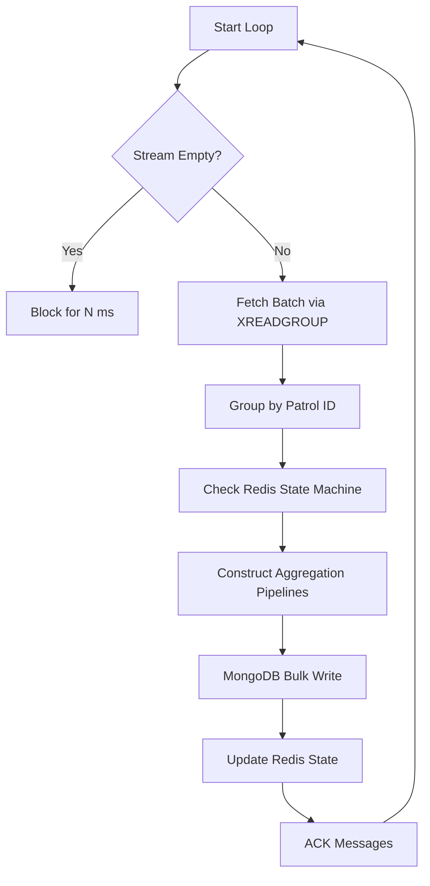

# Stream Processing Worker

The **Stream Worker** is a high-throughput background service responsible for persisting high-velocity geospatial data. It acts as the "Consumer" in the Producer-Consumer architecture, decoupling the ingestion API from the database layer.

## 1. Architectural Role

While the API handles thousands of incoming requests per second, the Worker ensures data consistency and efficient storage without blocking the HTTP layer.

### The Processing Loop
The worker operates on an infinite loop with a **Batch-and-Flush** strategy:


## 2. Redis Stream Consumer Strategy
The worker utilizes **Redis Consumer Groups** (`mongo_writer_group`) to enable horizontal scalability.

*   **Load Balancing:** Multiple instances of this script can run simultaneously. Redis distributes messages among them automatically.
*   **Fault Tolerance:** If a worker crashes mid-batch, messages remain in the `Pending entries list (PEL)` and are reclaimed by other workers via standard Redis Stream recovery mechanisms.
*   **Batching Logic:**
    *   **Count-based:** Processes immediately if `TARGET_BATCH_SIZE` (5) is reached.
    *   **Time-based:** Flushes whatever is available if `MAX_BATCH_WAIT_SECONDS` (2.0s) elapses.
## 3. Patrol State Machine
One of the core challenges is handling **Patrol Status Changes** (e.g., switching from "Patrol" to "Emergency Pursuit") in real-time. The GeoJSON specification requires different `LineString` segments for different semantic activities.

To solve this without querying MongoDB for every point, the worker maintains a lightweight **State Machine in Redis**.

*   **Key:** `patrol:last_status` (Hash Map)
*   **Logic:**
    1.  Worker fetches the batch.
    2.  It queries Redis to see the *last known status* of the patrol.
    3.  **Comparison:**
        *   If `current_payload_status == last_known_status`: **Append** coordinates to the current segment.
        *   If `current_payload_status != last_known_status`: **Initialize** a new segment (`MultiLineString`).
## 4. Atomic MongoDB Operations
Writing high-frequency GPS data to a document-oriented database requires careful handling to avoid race conditions and document bloating. We utilize **MongoDB Aggregation Pipelines inside Updates**.

### The "Append" Problem
Standard `$push` operations are simple, but merging high-speed points into specific sub-arrays of a `MultiLineString` requires logic.

### The Pipeline Solution
We use a conditional update pipeline to handle the append logic atomically on the database server:

```python
# Logic implemented in the worker pipeline construction
update_pipeline = [
    {
        '$set': {
            'coordinates': {
                '$let': {
                    'vars': {'current': '$coords'},
                    'in': {
                        '$cond': {
                            # If array empty, create new segment
                            'if': {'$eq': [{'$size': '$$current'}, 0]},
                            'then': [new_points],
                            # Else, append to the LAST segment in the MultiLineString
                            'else': {
                                '$concatArrays': [
                                    # All segments except the last
                                    {'$slice': ['$$current', 0, -1]},
                                    # The last segment + new points
                                    [{'$concatArrays': [{'$last': '$$current'}, new_points]}]
                                ]
                            }
                        }
                    }
                }
            }
        }
    }
]
```
**Impact:** This ensures that even if multiple workers are processing data for the same patrol, the logic remains consistent based on the document state at the exact moment of writing.

## 5. Bulk Write Optimization
To minimize network round-trips to the database cluster, the worker uses `mongo_collection.bulk_write()`.

1.  **Accumulation:** The worker iterates through the Redis batch and builds a list of `UpdateOne` operations in memory.
2.  **Execution:** A single network request sends all operations to MongoDB.
3.  **Acknowledgement:** Only after the `bulk_write` returns successfully does the worker send `XACK` to Redis, confirming the data is durable.

## 6. Error Handling
*   **Malformed Data:** Messages that fail JSON parsing are logged as errors and immediately Acknowledged (`XACK`) to prevent them from clogging the stream (Poison Pill handling).
*   **Database Down:** If MongoDB is unreachable, the worker catches the exception, sleeps, and retries. The messages remain in Redis, ensuring **Zero Data Loss**.