# Platform Architecture

Sentinel is architected as a **decoupled, multi-engine platform**. It separates the heavy, offline batch processing (map generation) from the low-latency, real-time services (telemetry and routing).

## System Component Diagram

```mermaid
%%{
  init: {
    'theme': 'base',
    'themeVariables': {
      'primaryColor': '#1e1e1e',
      'primaryTextColor': '#e0e0e0',
      'primaryBorderColor': '#444',
      'lineColor': '#a9b7c6',
      'secondaryColor': '#2d2d2d',
      'tertiaryColor': '#2d2d2d',
      'fontFamily': 'arial',
      'fontSize': '14px'
    }
  }
}%%

flowchart TD
    %% --- DEFINE NODES ---
    A(🧠 <b>ROUTING ENGINE</b><br/><i style='font-size:12px; color:#aaa'>LKH & A* Solvers</i>):::logic
    B(⚡ <b>TELEMETRY API</b><br/><i style='font-size:12px; color:#aaa'>FastAPI Producer</i>):::logic
    C(🏭 <b>MAP ETL ENGINE</b><br/><i style='font-size:12px; color:#aaa'>Python Orchestrator</i>):::logic

    D1[("🐘 <b>POSTGRES / POSTGIS</b><br/><i style='font-size:12px; color:#aaa'>Relational & Geospatial</i>")]:::database
    D2[("🍃 <b>MONGODB</b><br/><i style='font-size:12px; color:#aaa'>GeoJSON Document Store</i>")]:::database
    D3[("♦️ <b>REDIS STREAMS</b><br/><i style='font-size:12px; color:#aaa'>High-Speed Buffer</i>")]:::database
    
    H([🖥️ <b>i9 COMPUTE NODE</b><br/><i style='font-size:12px; color:#aaa'>Temporal / On-Prem</i>]):::hardware
    
    I(☁️ <b>CLOUDFLARE EDGE</b><br/><i style='font-size:12px; color:#aaa'>R2 Storage & CDN</i>):::cloud
    J([📱 <b>POLICE MOBILE APP</b><br/><i style='font-size:12px; color:#aaa'>Field Operations</i>]):::mobile

    %% --- DEFINE CLUSTERS ---
    subgraph BACKEND [SENTINEL PLATFORM]
        direction TB
        subgraph SERVICES [REAL-TIME SERVICES]
            direction LR
            A 
            B
        end
        
        subgraph ETL [BATCH PROCESSING ENGINE]
            C
        end

        subgraph DATA [POLYGLOT DATA LAYER]
            direction LR
            D1 
            D2 
            D3
        end
    end
    
    %% --- DEFINE CONNECTIONS ---
    J -- Sends GPS --> B
    J -- Requests Route --> A
    J -- Fetches Tactical Map --> I
    
    B -- Pushes to --> D3
    A -- Reads from --> D1
    A -- Writes to --> D2
    
    subgraph WORKER [Async Worker]
      direction LR
      style WORKER fill:none,stroke:none
      D3 -- Consumed by --> D2
    end

    H -- Runs --> ETL
    ETL -- Creates Map for --> I
    
    %% --- STYLING ---
    classDef hardware fill:#263238,stroke:#546e7a,stroke-width:2px,color:#eceff1,rx:5,ry:5;
    classDef logic fill:#3e2723,stroke:#ff5722,stroke-width:2px,color:#ffccbc,rx:0,ry:0;
    classDef database fill:#1a237e,stroke:#5c6bc0,stroke-width:2px,color:#e8f5e6;
    classDef cloud fill:#0d47a1,stroke:#42a5f5,stroke-width:2px,color:#e3f2fd;
    classDef mobile fill:#1b5e20,stroke:#66bb6a,stroke-width:3px,color:#e8f5e9;
```

## Architectural Pillars

### 1. The Backend Platform
This is the "brain" of Sentinel, composed of three distinct but interconnected engines:
*   **The Routing Engine:** Handles all complex pathfinding (TSP & A*).
*   **The Telemetry API:** A high-speed ingestion point for live GPS data.
*   **The Map ETL Engine:** The offline "factory" that builds the base map.

### 2. The Data Layer
Sentinel uses a **polyglot persistence** strategy, choosing the right database for the right job:
*   **PostgreSQL/PostGIS:** The "Source of Truth" for relational data (Patrols, Hotspots) and the high-performance engine for the map render.
*   **MongoDB:** Used as a document store for flexible GeoJSON route geometries, optimized for fast reads by the live dashboard.
*   **Redis Streams:** Acts as a high-speed, durable buffer to decouple the live telemetry API from the slower MongoDB persistence layer.

### 3. The Infrastructure
*   **Local Compute Node:** The entire backend platform runs on a high-performance i9 node, managed by the **Temporal Computing** orchestrator to minimize costs.
*   **Cloud Edge:** The final, static map assets (`.pmtiles`) are exfiltrated to the Cloudflare network for secure, low-latency global delivery.