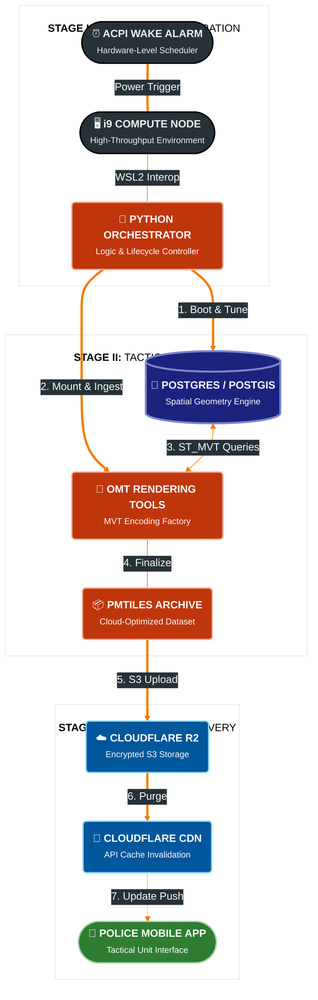

# System Architecture: The Umbrella

Sentinel bridges high-performance local compute with cloud-native delivery.

```mermaid
%%{init: {
  'theme': 'base',
  'themeVariables': {
    'primaryColor': '#1a237e',
    'primaryTextColor': '#fff',
    'primaryBorderColor': '#0d47a1',
    'lineColor': '#f57c00',
    'secondaryColor': '#263238',
    'tertiaryColor': '#ffffff',
    'subgraphPadding': 25
  }
}}%%
flowchart TD
    %% Node Definitions with Icons
    A(["⏰ <b>ACPI WAKE ALARM</b><br/><font size='2'>Hardware-Level Scheduler</font>"])
    B(["🖥️ <b>i9 COMPUTE NODE</b><br/><font size='2'>High-Throughput Environment</font>"])
    C("🐍 <b>PYTHON ORCHESTRATOR</b><br/><font size='2'>Logic & Lifecycle Controller</font>")
    
    D[("🐘 <b>POSTGRES / POSTGIS</b><br/><font size='2'>Spatial Geometry Engine</font>")]
    E("🐳 <b>OMT RENDERING TOOLS</b><br/><font size='2'>MVT Encoding Factory</font>")
    
    F("📦 <b>PMTILES ARCHIVE</b><br/><font size='2'>Cloud-Optimized Dataset</font>")
    G("☁️ <b>CLOUDFLARE R2</b><br/><font size='2'>Encrypted S3 Storage</font>")
    H("🚀 <b>CLOUDFLARE CDN</b><br/><font size='2'>API Cache Invalidation</font>")
    I(["📱 <b>POLICE MOBILE APP</b><br/><font size='2'>Tactical Unit Interface</font>"])

    %% --- STAGE 1: PHYSICAL INFRASTRUCTURE ---
    subgraph STAGE_1 ["‎<br/><b>STAGE I:</b> PHYSICAL ORCHESTRATION<br/>‎"]
        direction TB
        A ===|Power Trigger| B
        B ---|WSL2 Interop| C
    end

    %% --- STAGE 2: TACTICAL ETL ---
    subgraph STAGE_2 ["‎<br/><b>STAGE II:</b> TACTICAL ETL ENGINE<br/>‎"]
        direction TB
        C ==>|1. Boot & Tune| D
        C ==>|2. Mount & Ingest| E
        D <-->|3. ST_MVT Queries| E
        E ---|4. Finalize| F
    end

    %% --- STAGE 3: CLOUD EDGE ---
    subgraph STAGE_3 ["‎<br/><b>STAGE III:</b> CLOUD EDGE DELIVERY<br/>‎"]
        direction TB
        F ==>|5. S3 Upload| G
        G ==>|6. Purge| H
        H -.->|7. Update Push| I
    end

    %% --- Styling Classes ---
    classDef hardware fill:#263238,stroke:#000,stroke-width:2px,color:#eceff1;
    classDef logic fill:#bf360c,stroke:#ffab91,stroke-width:2px,color:#fff;
    classDef database fill:#1a237e,stroke:#7986cb,stroke-width:3px,color:#fff;
    classDef cloud fill:#01579b,stroke:#81d4fa,stroke-width:2px,color:#fff;
    classDef mobile fill:#2e7d32,stroke:#a5d6a7,stroke-width:2px,color:#fff;

    class A,B hardware;
    class C,E,F logic;
    class D database;
    class G,H cloud;
    class I mobile;
```