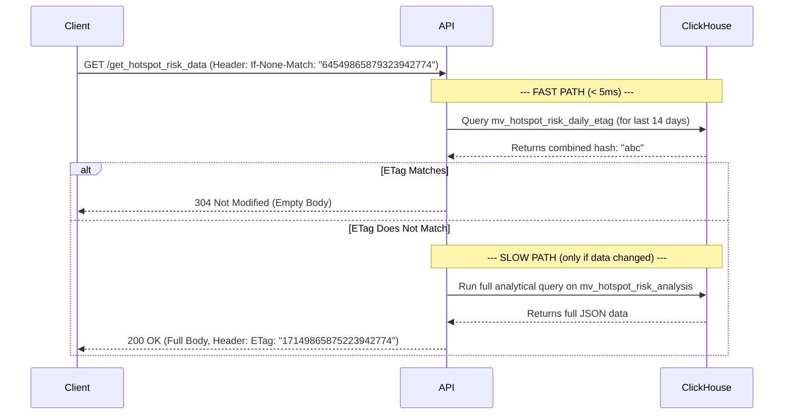

# High-Performance Caching: The ETag Architecture

To deliver a sub-second, real-time feel on a data-intensive dashboard, the Sentinel platform employs a sophisticated, multi-layered caching strategy centered around **HTTP ETags**. This approach dramatically reduces database load and network bandwidth by preventing the re-fetching of unchanged data.

This is not a simple time-based cache (`max-age`). It is a **validation-based** system that asks the server, "Has the data changed?" instead of "Give me the data again."

---

## 1. The Architectural Problem
Without a smart caching strategy, every user interaction (like changing a date filter) would trigger a heavy, expensive query against the ClickHouse data warehouse. This would lead to:

*   Slow dashboard performance for the user.
*   High and unnecessary CPU load on the database server.
*   Wasted network bandwidth sending redundant JSON payloads.

---

## 2. The Solution: "ETag Views" in ClickHouse
The core of the solution is to pre-calculate a "fingerprint" or "checksum" of the data's state directly within the data warehouse. We achieve this using a dedicated **Materialized View** for each analytical component.

### The "Daily Fingerprint" Pattern
Instead of hashing the entire dataset on every request, we create a materialized view that calculates a daily hash for each entity (e.g., each hotspot). The API then combines these daily hashes for the requested time window.

#### Example: The Hotspot Risk ETag View
This view watches the `patrol_events` table and maintains a daily "fingerprint" for each hotspot's risk activity.

```sql
CREATE MATERIALIZED VIEW mv_hotspot_risk_daily_etag
ENGINE = AggregatingMergeTree()
ORDER BY (hotspot_id, event_date)
POPULATE
AS SELECT
    assumeNotNull(hotspot_id) as hotspot_id,
    event_date,
    groupBitXorState(
        cityHash64(
            event_id, 
            static_risk_score,
            dynamic_risk_score
        )
    ) AS daily_etag_hash_state

FROM patrol_events
WHERE 
    hotspot_id IS NOT NULL
    AND (static_risk_score + dynamic_risk_score) > 0
GROUP BY hotspot_id, event_date;
```

---

## 3. The API Workflow: "Fast Path / Slow Path"

The FastAPI endpoint now follows a highly efficient two-path logic.

### The API ETag Query
The query to generate the final ETag is incredibly fast because it operates on the tiny, pre-aggregated daily hash view.
```sql
-- This query combines daily hashes into a single, global ETag for the time window
SELECT
    -- Combine all the daily hashes from the relevant time window into one final fingerprint
    cityHash64(
        groupBitXorMerge(daily_etag_hash_state)
    )
FROM mv_hotspot_risk_daily_etag
WHERE event_date >= today() - {num_days: UInt16}
```

---

## 4. Architectural Impact
*   **Performance**: For cached responses, API latency is reduced from ~500ms (for a full data query) to <10ms.
*   **Scalability**: The load on the ClickHouse server is drastically reduced, as the vast majority of requests no longer trigger expensive analytical queries.
*   **Efficiency**: Bandwidth usage for both the server and the police mobile clients is minimized.

This ETag architecture is a critical component of the Sentinel platform, enabling a highly interactive, real-time analytical experience on a massive historical dataset.