# Analytical Data Modeling (ClickHouse)

The Sentinel Data Warehouse is the analytical heart of the platform. Its design was driven by two primary goals: 
1.  **Performance Isolation:** To completely separate heavy analytical queries from the real-time transactional (OLTP) database.
2.  **Sub-Second Analytics:** To power a highly interactive dashboard with instantaneous response times.

To achieve this, we implemented a **Star Schema** architecture using a central, granular **Fact Table** and a set of purpose-built **Materialized Views**.

---

## 1. The Architectural Pattern: Fact Table + Presentation Layer

Instead of querying the raw, normalized PostgreSQL data, the dashboard queries a hyper-optimized ClickHouse warehouse. The warehouse itself is composed of two layers: a granular "Source of Truth" and a pre-aggregated "Presentation Layer."

```mermaid
%%{
  init: {
    'theme': 'base',
    'themeVariables': {
      'primaryColor': '#1e1e1e',
      'primaryTextColor': '#e0e0e0',
      'primaryBorderColor': '#444',
      'lineColor': '#a9b7c6',
      'secondaryColor': '#2d2d2d',
      'tertiaryColor': '#2d2d2d'
    }
  }
}%%
flowchart TD
    %% --- DEFINE NODES ---
    A[("
        🐘 <b>patrol_events</b>
        <br/>
        <i style='font-size:12px; color:#aaa'>Granular Fact Table</i>
    ")]:::database

    B[("
       ⚡ <b>PRESENTATION LAYER</b>
        <br/>
        <i style='font-size:12px; color:#aaa'>Pre-Aggregated Materialized Views</i>"
    )]:::presentation

    C[("
        🚀 <b>ANALYTICS API SERVICE</b>
        <br/>
        <i style='font-size:12px; color:#aaa'>FastAPI Endpoints</i>
    ")]:::api

    %% --- DEFINE CLUSTERS & FLOW (Using the simpler, working syntax) ---
    subgraph Data_Warehouse [CLICKHOUSE OLAP ENGINE]
        direction TB
        A ==>|<b>ETL Loads Data</b>| B
    end

    B -.->|<b>Serves Aggregated Data</b>| C

    %% --- STYLING DEFINITIONS ---
    classDef database fill:#1a237e,stroke:#7986cb,stroke-width:3px,color:#e8eaf6;
    classDef presentation fill:#004d40,stroke:#26a69a,stroke-width:2px,color:#e0f2f1;
    classDef api fill:#3e2723,stroke:#ff5722,stroke-width:2px,color:#ffccbc; 
```

<div class="mermaid-container" style="display: flex; justify-content: center;">

</div>
---

## 2. The Core Layer: The `patrol_events` Fact Table
This is the "Single Source of Truth" for all analytics. It's designed using an **Event Sourcing** model, where every row represents a single, atomic event that occurred during a patrol.

### Design Rationale:
*   **Event-Driven:** Instead of modeling "patrols," we model "events." This makes the schema infinitely extensible. New operational data can be added as a new `event_type` without requiring a schema migration.
*   **Denormalized for Speed:** The table intentionally includes redundant data (e.g., `station_id`) on every row to avoid slow `JOIN` operations during analytical queries.
*   **Granularity:** It stores both **Base Facts** (e.g., raw `remark_text`) and **Derived Metrics** (e.g., `base_risk_score`). This allows for both high-speed KPI aggregation and deep-dive forensic analysis.

### The Schema
The fact table is intentionally wide and denormalized, containing over 40 columns that capture core dimensions, flattened event-specific fields, and pre-calculated metrics.

Below is a **representative sample** of the schema that highlights the key design principles.

**The complete, unabridged schema definition can be viewed here: [Full Schema SQL File](../assets/sql/patrol_events_schema.sql)**
```sql


CREATE TABLE IF NOT EXISTS sentinel_analytics.patrol_events
(
    -- === CORE DIMENSIONS ===
    event_id            String,
    patrol_id           UInt64,
    officer_id          UInt64,
    event_timestamp     DateTime,
    event_date          Date,
    event_type          String,
    
    -- === DENORMALIZED CONTEXT ===
    station_id          UInt64,
    
    -- === FLATTENED EVENT FIELDS (Sample) ===
    hotspot_id          Nullable(UInt64),
    remark_text         Nullable(String),
    vehicle_plate_number Nullable(String),
    suspicious_activity Nullable(UInt8),
    
    -- === DERIVED METRICS ===
    base_risk_score     Float64 DEFAULT 0.0

)
ENGINE = MergeTree()
PARTITION BY toYYYYMM(event_date)
ORDER BY (event_date, station_id, officer_id, event_type);
```
The full schema includes additional flattened fields for all event types (Emergency Incidents, Stranger Encounters, etc.) and detailed location/device telemetry. It can be viewed in the linked SQL file.

---

## 3. The Presentation Layer: Materialized Views
To achieve sub-second dashboard performance, we do not query the massive `patrol_events` table directly. Instead, each dashboard component queries its own small, purpose-built **Materialized View**.

These views act as **automated, incremental aggregation triggers**. Every time new data is inserted into `patrol_events`, ClickHouse automatically updates these views in the background.

### Example: The Hotspot Risk Analysis View
This view powers the "Top 5 Active Hotspots" component on the dashboard. It calculates a time-decayed risk score and determines the primary incident type and trend for every hotspot.

```sql
CREATE MATERIALIZED VIEW mv_hotspot_risk_analysis
ENGINE = AggregatingMergeTree()
ORDER BY (hotspot_id)
POPULATE
AS SELECT
    assumeNotNull(hotspot_id) as hotspot_id,
    
    -- Find the most frequent incident type for this hotspot
    topKIfState(1)(emergency_category, emergency_category IS NOT NULL) as top_incident_category_state,

    -- Calculate risk score for the RECENT period (last 7 days)
    sumStateIf(
        base_risk_score * exp(-0.05 * dateDiff('hour', event_timestamp, now())),
        event_timestamp >= now() - interval 7 day
    ) as risk_recent_state,

    -- Calculate risk score for the PREVIOUS period (8-14 days ago)
    sumStateIf(
        base_risk_score * exp(-0.05 * dateDiff('hour', event_timestamp, now() - interval 7 day)),
        event_timestamp >= now() - interval 14 day AND event_timestamp < now() - interval 7 day
    ) as risk_previous_state

FROM patrol_events
-- Ensure the key is not null
WHERE hotspot_id IS NOT NULL
GROUP BY hotspot_id;
```

**Impact:** A query for the top 5 riskiest hotspots is no longer a slow scan over millions of events. It's a simple, fast `SELECT ...Merge` on a small view that contains one row per hotspot. This is the key to our performance.

---

## 4. Summary of Data Modeling Principles

| Principle | Implementation | Benefit |
| :--- | :--- | :--- |
| **OLAP/OLTP Separation** | Separate Postgres and ClickHouse databases. | Protects live application from analytical load. |
| **Event Sourcing** | `patrol_events` fact table with `event_type`. | Extensibility and powerful funnel analysis. |
| **Denormalization** | Pre-joining data in the ETL. | Eliminates slow `JOIN`s at query time. |
| **Pre-Aggregation** | Using Materialized Views for each dashboard component. | Sub-second dashboard latency. |