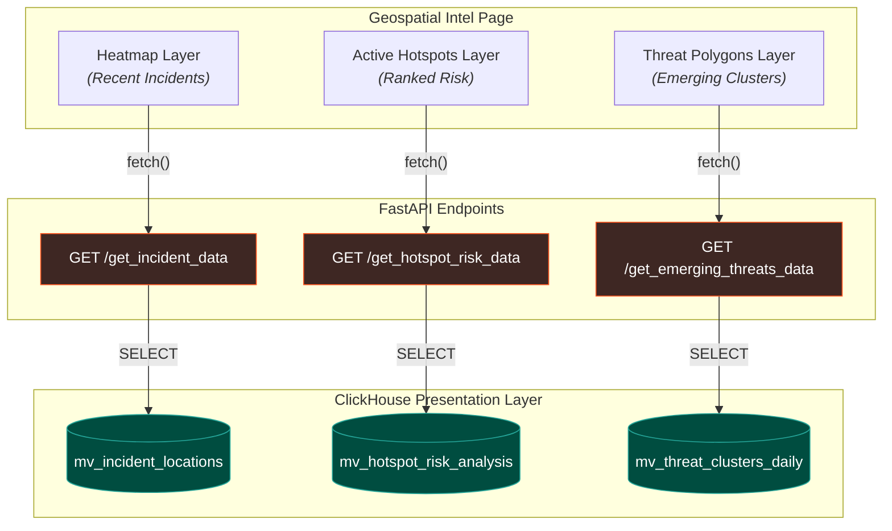

# Analytics Deep Dive: The Geospatial Intelligence Page

The **Geospatial Intelligence Page** is the analytical core of the Sentinel Dashboard. It provides commanders with a multi-layered, real-time view of risk and activity across the city of Kochi.

To achieve sub-second load times for this data-intensive page, the backend utilizes a **Presentation Layer** of pre-aggregated **Materialized Views** in ClickHouse. Each major feature on the page is powered by its own specialized view and a dedicated, hyper-optimized API endpoint.

---

## 1. Feature Architecture
The page is composed of three distinct analytical layers, each with its own data pipeline and caching strategy. This decoupled design ensures that a slow or failing component does not impact the rest of the user interface.



---

## 2. Feature: The Incident Heatmap
This layer provides an at-a-glance visualization of where incidents are concentrated over a rolling time window.

### The Materialized View: `mv_incident_locations`
This view is a simple, "timeless" log of all incident locations, designed for fast retrieval.
```sql
CREATE MATERIALIZED VIEW mv_incident_locations
ENGINE = MergeTree()
PARTITION BY toYYYYMM(event_date)
ORDER BY (event_date)
POPULATE
AS SELECT
    event_date,
    longitude,
    latitude
FROM patrol_events
WHERE 
    event_type = 'EMERGENCY_INCIDENT' 
    -- Keep a rolling 7-day window of incidents for the heatmap
    AND event_date >= today() - 7;
```
### The API Endpoint: `GET /geospatial/get_incident_data`
This endpoint fetches the raw data from the view and applies a time window, formatting it as a GeoJSON `FeatureCollection` for the map.

---

## 3. Feature: The "Active Hotspots"
This component identifies and ranks pre-defined hotspots based on a time-decayed risk score.

### The Materialized View: `mv_hotspot_risk_analysis`
This is the core analytical engine. It pre-aggregates all risk-bearing events into a daily summary for each hotspot.
```sql
CREATE MATERIALIZED VIEW mv_hotspot_risk_analysis
ENGINE = AggregatingMergeTree()
ORDER BY (hotspot_id_non_nullable, event_date)
POPULATE
AS SELECT
    assumeNotNull(hotspot_id) as hotspot_id_non_nullable,
    event_date,
    argMaxState(hotspot_name, event_timestamp) as latest_hotspot_name_state,
    -- topKState(1)(assumeNotNull(emergency_category)) as top_incident_category_state,

    -- 1. Calculate risk score for the RECENT period (last 7 days)
    sumStateIf(
        (static_risk_score + dynamic_risk_score) * exp(-0.05 * dateDiff('hour', event_timestamp, now())),
        event_timestamp >= now() - interval 7 day
    ) as risk_recent_state,

    -- 2. Calculate risk score for the PREVIOUS period (8-14 days ago)
    sumStateIf(
        (static_risk_score + dynamic_risk_score) * exp(-0.05 * dateDiff('hour', event_timestamp, now() - interval 7 day)),
        event_timestamp >= now() - interval 14 day AND event_timestamp < now() - interval 7 day
    ) as risk_previous_state

FROM patrol_events
WHERE 
    hotspot_id IS NOT NULL
GROUP BY hotspot_id, event_date;
```
### The API Query
The API runs a "final aggregation" query on the daily view to calculate the trend and final score.
```sql
-- API query for GET /geospatial/get_hotspot_risk_data?days=7
SELECT 
    hotspot_id_non_nullable as hotspot_id,
    event_date,
    argMaxMerge(latest_hotspot_name_state) as hotspot_name,
    -- Merge the states to get the final scores
    sumMerge(risk_recent_state) AS risk_recent,
    sumMerge(risk_previous_state) AS risk_previous,
    
    CASE
        WHEN risk_recent > (risk_previous * 1.1) THEN 'increasing' -- Add a 10% buffer to avoid noise
        WHEN risk_recent < (risk_previous * 0.9) THEN 'decreasing' -- Add a 10% buffer
        ELSE 'stable'
    END AS trend
    
FROM mv_hotspot_risk_analysis
WHERE event_date >= today() - {num_days: UInt16}
GROUP BY hotspot_id_non_nullable, event_date
HAVING risk_recent > 0
ORDER BY risk_recent DESC
LIMIT 10
```

---

## 4. Feature: The "Emerging Threats" Polygon Layer
This advanced feature identifies clusters of risk in areas that are *not* necessarily known hotspots, using Uber's H3 geospatial index.

### The Materialized View: `mv_threat_clusters_daily`
This view aggregates risk not by a hotspot ID, but by a geographic **H3 cell**.
```sql
CREATE MATERIALIZED VIEW mv_threat_clusters_daily
ENGINE = AggregatingMergeTree()
ORDER BY (h3_cell, event_date)
POPULATE
AS SELECT
    assumeNotNull(h3ToString(geoToH3(longitude, latitude, 8))) as h3_cell,
    event_date,
    
    sumState(static_risk_score + dynamic_risk_score) as daily_risk_state

FROM patrol_events
WHERE 
    (static_risk_score + dynamic_risk_score) > 0
    AND isNotNull(latitude)
    AND isNotNull(longitude)
GROUP BY h3_cell, event_date;
```
### The API Logic: `GET /geospatial/get_emerging_threats_data`
1.  The API queries `mv_threat_clusters_daily` to get the highest-risk `h3_cell` IDs for a given time window.
2.  It then uses the `h3-py` library to convert these cell IDs into GeoJSON `Polygon` features for the frontend to render.

---

## 5. Performance & Caching
All endpoints for the Geospatial Intel Page use a robust **ETag caching** strategy. The ETag is calculated at the API layer by running a lightweight `cityHash64` query against the relevant materialized view, ensuring that heavy data queries are only executed when the underlying data has actually changed.