# System Architecture: The Sentinel Umbrella

Sentinel bridges high-performance local compute with cloud-native edge delivery to provide Kochi City Police with an immutable, rapidly updated tactical map.

## The Three-Tier Orchestration
The platform is architected to decouple the heavy compute logic from the deployment and hardware management layers.

### 1. The Hardware Layer (Physical Node)

* **Hardware:** i9-13900H / 20-Core / NVMe SSD.

* **Control:** Windows Task Scheduler utilizing ACPI Wake Alarms to trigger "Temporal Compute" windows.

* **Bridge:** WSL2 (Windows Subsystem for Linux) acts as the high-speed interface between Windows hardware and the Linux Docker engine.

### 2. The Orchestration Layer (Controller)

* **Controller:** A custom Python orchestrator that manages the lifecycle of ephemeral containers.

* **State Management:** Handles volume mounting, relational dependency cleanups, and health-checks (e.g., waiting for the PostGIS socket).

* **Isolation:** Utilizes Docker-in-Docker (DinD) logic to keep the rendering environment clean.

### 3. The Deployment Layer (Cloud Edge)

* **Storage:** Cloudflare R2 (S3-Compatible) stores the immutable PMTiles archives.

* **Distribution:** Cloudflare CDN with automated API-driven cache invalidation upon successful ETL completion.

## System Workflow Diagram

```mermaid
%%{
  init: {
    'theme': 'base',
    'themeVariables': {
      'primaryColor': '#1e1e1e',
      'primaryTextColor': '#e0e0e0',
      'primaryBorderColor': '#444',
      'lineColor': '#a9b7c6',
      'secondaryColor': '#2d2d2d',
      'tertiaryColor': '#2d2d2d',
      'fontFamily': 'arial',
      'fontSize': '14px'
    }
  }
}%%

flowchart TD
    %% --- CLUSTER 1: PHYSICAL INFRASTRUCTURE ---
    subgraph STAGE_1 ["<br/>&nbsp;&nbsp;&nbsp;<b>STAGE I:</b> HARDWARE ORCHESTRATION&nbsp;&nbsp;&nbsp;<br/>&nbsp;"]
        direction TB
        A([⏰ <b>ACPI WAKE ALARM</b><br/><i style='font-size:12px; color:#aaa'>BIOS / Task Scheduler</i>]):::hardware
        B([🖥️ <b>i9 COMPUTE NODE</b><br/><i style='font-size:12px; color:#aaa'>20-Core / NVMe / AC</i>]):::hardware
        C[[🐍 <b>PYTHON ORCHESTRATOR</b><br/><i style='font-size:12px; color:#aaa'>Lifecycle Controller</i>]]:::logic
        
        A ==>|<b>Power On</b>| B
        B -.->|<b>WSL2 Boot</b>| C
    end

    %% --- CLUSTER 2: COMPUTE PLANE ---
    %% THE FIX: Added extra <br/> tags below to push nodes down
    subgraph STAGE_2 ["<br/>&nbsp;&nbsp;&nbsp;<b>STAGE II:</b> TACTICAL ETL ENGINE&nbsp;&nbsp;&nbsp;<br/><br/><br/>&nbsp;"]
        direction TB
        
        %% --- NESTED INVISIBLE SUBGRAPH FOR HORIZONTAL ALIGNMENT ---
        subgraph COMPUTE_CORE [" "]
            direction LR
            style COMPUTE_CORE fill:none,stroke:none,color:#00000000
            D[("🐘 <b>POSTGIS ENGINE</b><br/><i style='font-size:12px; color:#aaa'>Shared Buffers: 2GB</i>")]:::database
            E(⚙️ <b>OMT RENDERER</b><br/><i style='font-size:12px; color:#aaa'>19 Parallel Streams</i>):::processing
        end
        
        F(📦 <b>PMTILES ARCHIVE</b><br/><i style='font-size:12px; color:#aaa'>Cloud-Optimized Binary</i>):::artifact

        C -->|1. Tune & Clean| D
        C -->|2. Mount & Ingest| E
        D <==>|<b>3. Geometry Math</b>| E
        E ==>|<b>4. Serialize</b>| F
    end

    %% --- CLUSTER 3: DELIVERY ---
    subgraph STAGE_3 ["<br/>&nbsp;&nbsp;&nbsp;<b>STAGE III:</b> CLOUD EDGE DELIVERY&nbsp;&nbsp;&nbsp;<br/>&nbsp;"]
        direction TB
        G(☁️ <b>CLOUDFLARE R2</b><br/><i style='font-size:12px; color:#aaa'>S3 Object Storage</i>):::cloud
        H(🚀 <b>EDGE CACHE</b><br/><i style='font-size:12px; color:#aaa'>Global CDN</i>):::cloud
        I([📱 <b>POLICE FIELD APP</b><br/><i style='font-size:12px; color:#aaa'>Tactical Interface</i>]):::mobile

        F ==>|<b>5. Encrypted Upload</b>| G
        G -.->|<b>6. Invalidate</b>| H
        H -.->|<b>7. HTTP Range Req</b>| I
    end

    %% --- DEFINING STYLES ---
    classDef hardware fill:#263238,stroke:#546e7a,stroke-width:2px,color:#eceff1,rx:5,ry:5;
    classDef logic fill:#3e2723,stroke:#ff5722,stroke-width:2px,color:#ffccbc,rx:0,ry:0;
    classDef database fill:#1a237e,stroke:#5c6bc0,stroke-width:2px,color:#e8eaf6;
    classDef processing fill:#004d40,stroke:#26a69a,stroke-width:2px,color:#e0f2f1;
    classDef artifact fill:#37474f,stroke:#cfd8dc,stroke-width:2px,stroke-dasharray: 5 5,color:#fff;
    classDef cloud fill:#0d47a1,stroke:#42a5f5,stroke-width:2px,color:#e3f2fd;
    classDef mobile fill:#1b5e20,stroke:#66bb6a,stroke-width:3px,color:#e8f5e9;

    %% --- LINK STYLING ---
    linkStyle 0,3,4,5 stroke:#ff5722,stroke-width:3px;
    linkStyle 1,2 stroke:#90a4ae,stroke-width:2px,stroke-dasharray: 5 5;
    linkStyle 6,7,8 stroke:#29b6f6,stroke-width:2px;
```



---

## 4. Technical Resilience

*   **Self-Healing:** The database is wiped of "dirty" schemas and views using `CASCADE` drops at the start of every run.
*   **Network Warm-up:** Includes a `bash until` loop to ensure DNS propagation within the virtual Docker network before beginning the data transfer.
*   **Automated Recovery:** Hardware is instructed to return to **S4 Hibernate** even if a pipeline stage fails, preventing unnecessary power consumption.

# Performance Engineering: PostGIS Optimization

The most significant achievement of this project was reducing a **21-day** rendering estimate to a **10-minute** execution window. This required deep-level tuning of the database engine.

## 1. Disabling JIT (Just-In-Time Compilation)
*   **The Problem:** PostGIS MVT queries are computationally complex. Modern PostgreSQL versions attempt to use JIT to optimize these queries. However, the overhead of "compiling" the plan for every tile was exceeding the actual query time, causing 1800% CPU usage with negligible output.
*   **The Fix:**
    ```sql
    ALTER SYSTEM SET jit = off;
    ```
*   **Result:** Removed 40% CPU overhead, allowing the processor to focus purely on geometry clipping and simplification.

## 2. SSD Latency & Spatial Indexing
*   **The Problem:** Postgres defaults to a `random_page_cost` of 4.0, which assumes mechanical hard drives. This makes the query planner "afraid" to use spatial indexes, often defaulting to slow sequential scans.
*   **The Fix:**
    ```sql
    ALTER SYSTEM SET random_page_cost = 1.1;
    ```
*   **Result:** Forced the use of **GIST Spatial Indexes** on the NVMe SSD, resulting in sub-100ms response times per tile request.

## 3. Memory Allocation (Shared Buffers)
*   **The Problem:** Constantly reading geometry from disk is the death of high-speed rendering.
*   **The Fix:** Allocated **2GB** to `shared_buffers`. Since the Kochi regional dataset is ~55MB, the entire "hot" dataset is pulled into RAM during the first 30 seconds of the render.

## 4. Concurrent Streams
The i9 node features 20 logical cores. We scaled the ETL to utilize **19 parallel streams**.

*   **Parallelism Logic:** `(CPU_COUNT - 1)`
*   **Result:** Achieved a sustained throughput of **212 tiles per second**.

### Performance Benchmark

| Metric | Default Config | Sentinel Optimized |
| :--- | :--- | :--- |
| **Throughput** | ~1.5 tiles/sec | **212 tiles/sec** |
| **Estimated Time** | 21 Days | **10 Minutes** |
| **Hardware State** | High I/O Wait (HDD-bound) | **CPU Bound (In-Memory)** |
| **Parallelism** | Single Stream | **19 Parallel Streams** |
| **Database Tuning** | Default Postgres | **JIT Off / SSD Optimized** |

---

# Infrastructure: Temporal Computing

To reduce operational costs and hardware wear while maintaining 100% data sovereignty for the police department, Sentinel utilizes a **Temporal Computing** pattern.

## Zero-Watt Idle Strategy
Unlike a traditional cloud server that remains active 24/7, the Sentinel i9 node exists in a zero-power **S4 Hibernate** state for 99% of the month.

### 1. The Wake Trigger
Utilizes **ACPI (Advanced Configuration and Power Interface)** wake timers configured via the Windows Task Scheduler. The system wakes at 03:00 AM on a monthly schedule.

### 2. The Health Handshake
Since Docker Desktop's WSL kernel can take up to 60 seconds to re-initialize after a wake event, a **Bash-based health check** was implemented:

```bash
until docker info > /dev/null 2>&1; do 
    echo "Waiting for Docker daemon..."; 
    sleep 5; 
done
```
This ensures the "Engine" is fully running before the high-CPU Python script attempts to mount the Docker socket.

### 3. Hardware Interop (WSL to Windows)
Because the pipeline runs inside a Linux container, it has no native way to control the physical hardware. We utilize the **WSL Interop** feature to reach back out to the Windows host to trigger hibernation:

```bash
# Executed via the host Action wrapper
/mnt/c/Windows/System32/shutdown.exe /h
```
### 4. Benefits of this Architecture
*   **Cost:** Avoids monthly $100+ cloud bills for high-performance instances.
*   **Longevity:** By limiting "active" time to 15 minutes a month, hardware thermal stress is minimized.
*   **Security:** The database is physically powered off and unreachable for 29 days of the month.

---

# Security & Cloud Delivery

Once the tactical map is generated, it must be delivered to police field units securely and efficiently.

## 1. PMTiles Architecture
Sentinel uses the **PMTiles (v3)** format instead of standard MBTiles.

*   **Single-File:** Simplifies S3 management.
*   **HTTP Range Requests:** The mobile app only fetches specific "blobs" of the file required for the current view.
*   **Efficiency:** Reduced the 55MB MBTiles file to a **42MB** optimized archive, significantly lowering mobile data usage for patrolling officers.

## 2. Encrypted R2 Deployment
The orchestrator utilizes the S3 API to push the archive to **Cloudflare R2**.

*   **Data Sovereignty:** Data is encrypted at rest and in transit.
*   **Egress Costs:** Cloudflare R2 features **zero egress fees**, allowing Kochi Police to scale to hundreds of mobile units without increasing cloud costs.

## 3. CDN Cache Invalidation
To prevent officers from seeing stale tactical data, the orchestrator triggers an automated **CDN Purge** immediately after the R2 upload completes.

### The Implementation
The script verifies all credentials are present before hitting the Cloudflare Zone API. It uses a `try/except` block to ensure that a network failure during the purge doesn't crash the entire pipeline, although it logs the error for review.

```python
CLOUDFLARE_API_TOKEN = os.getenv("CLOUDFLARE_API_TOKEN")
CLOUDFLARE_ZONE_ID = os.getenv("CLOUDFLARE_ZONE_ID")
CLOUDFLARE_PURGE_URL = os.getenv("CLOUDFLARE_PURGE_URL")

if all([CLOUDFLARE_API_TOKEN, CLOUDFLARE_ZONE_ID, CLOUDFLARE_PURGE_URL]):
    logging.info("Purging Cloudflare CDN cache for the new PMTiles file...")
    
    headers = {
        "Authorization": f"Bearer {CLOUDFLARE_API_TOKEN}",
        "Content-Type": "application/json"
    }
    
    # We purge only the specific file URL, preserving cache for other assets
    payload = {"files": [CLOUDFLARE_PURGE_URL]}
    
    try:
        response = requests.post(
            f"https://api.cloudflare.com/client/v4/zones/{CLOUDFLARE_ZONE_ID}/purge_cache",
            headers=headers,
            json=payload
        )
        response.raise_for_status()
        logging.info(f"Cache purge request sent successfully. Response: {response.json()}")
    except requests.exceptions.RequestException as e:
        logging.error(f"Failed to send cache purge request: {e}")
else:
    logging.warning("Skipping CDN cache purge (Cloudflare credentials/URL not fully set in .env).")
```
This ensures that the "Global Update" is instantaneous once the i9 node finishes its 10-minute task.
---

# Operational Use: Kochi Police Mobile Ops

## Tactical Awareness in the Field
The primary consumer of the Sentinel ETL pipeline is the **Police Patrol App**.

### Key Features
1.  **Offline-First Maps:** Officers can download the 42MB PMTiles archive over Wi-Fi, ensuring full tactical awareness even in cellular dead zones.
2.  **High Resolution:** Updated Z14 detail allows officers to see building footprints and alleyways that are often missing from commercial map providers.
3.  **Night Visibility:** The tactical engine uses a specialized dark-mode schema designed for high contrast during night patrol shifts (23:00 - 05:00).

## Incident Integration
The tactical map layers are combined with real-time incident data from the backend API, allowing the command center to visualize patrol coverage vs. crime hotspots dynamically.