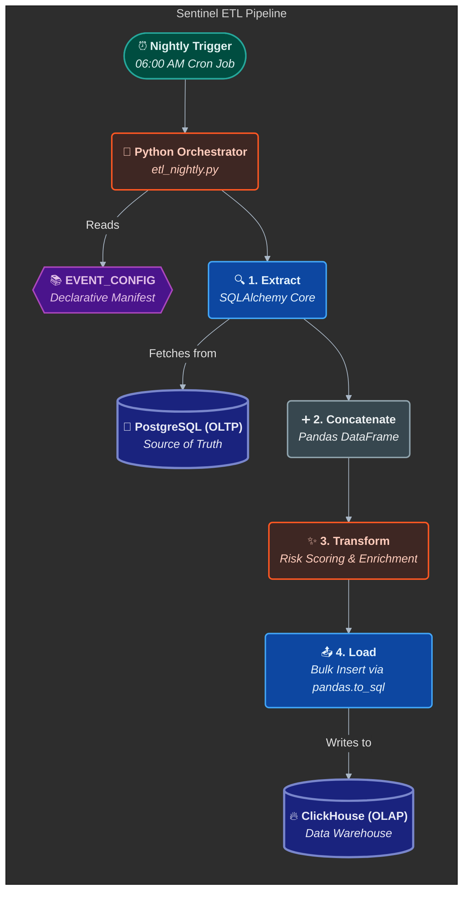

# The Sentinel Warehouse ETL Pipeline

The **Sentinel Warehouse ETL Pipeline** is a high-performance, automated data pipeline responsible for transforming raw operational data from the live PostgreSQL database into a hyper-optimized analytical fact table in ClickHouse.

This engine is the foundation of the entire Sentinel intelligence platform, enabling sub-second queries on historical data without impacting the performance of the real-time system.

## 1. Architectural Strategy: A Metadata-Driven Framework

Instead of a monolithic script, the ETL is architected as a **generic, metadata-driven framework**. The entire extraction logic is defined in a single, declarative Python dictionary called `EVENT_CONFIG`.

This design provides two key "Senior" level benefits:
1.  **Maintainability:** To add a new data source, a developer only needs to add a new entry to the configuration dictionary. No changes to the core processing logic are required.
2.  **Readability:** The `EVENT_CONFIG` acts as a self-documenting "manifest" of the entire data pipeline, explicitly defining the source tables, joins, and columns for each event type.

### The ETL Flow

## 2. Extraction Phase: Declarative & Optimized
The extraction phase uses a single, generic `extract_data` function that interprets the `EVENT_CONFIG`.

### Key Features:
*   **No `SELECT *`:** The configuration explicitly defines every column to be selected, preventing schema drift and minimizing data transfer.
*   **Multi-Join Support:** The framework supports complex data enrichment by allowing a list of `JOIN` definitions, including multi-condition `and_()` clauses.
*   **Declarative Filtering:** Business logic (e.g., `WHERE suspicious_activity = true`) is defined in the configuration, pushing filtering down to the database for maximum performance.
```python
# Example from EVENT_CONFIG, showing a multi-condition join
'HIGH_INTEGRITY_VISITS': {
    'model': Remark,
    'joins': [
        (Patrol, and_(
            Remark.patrol_id == Patrol.patrol_id,
            Patrol.patrol_status == 'COMPLETED'
        ))
    ],
    'columns': [Remark.remark_id, Patrol.start_time],
}
```
## 3. Transformation Phase: The "Pandas Refinery"
Once all raw data is extracted and concatenated into a single DataFrame, a robust `transform_data` function performs all cleaning and enrichment.

### A. Data Coalescing
A key challenge was unifying heterogeneous source data. For example, the `officer_id` could come from `created_by_officer_id` or `assigned_to_officer_id`.

**Solution:** A reusable `coalesce_columns` helper function was built. It intelligently merges multiple source columns into a single, clean target column, then drops the originals to prevent schema duplication.

### B. Conditional Enrichment
To optimize performance, summary data is only added where it is relevant. For example, the final `visited_hotspots` array is only fetched for patrols with a `'finished'` status.

**Solution:** This is handled with a **SQL `CASE` statement** directly in the `EVENT_CONFIG` extraction, which conditionally populates the column with data or `NULL`.
```python
# From EVENT_CONFIG
'columns': [
    # ...
    case(
        (PatrolLog.patrol_status == 'finished', Patrol.visited_hotspots),
        else_=None
    ).label('visited_hotspots')
]
```
### C. Heuristic Risk Engine
The transformation phase includes a configurable, rules-based risk engine.

*   **Logic:** A `RISK_WEIGHTS` dictionary assigns a base score to different event types and incident categories.
*   **Output:** A `base_risk_score` is calculated for each event and loaded into the warehouse, enabling time-decay analysis in the presentation layer.
## 4. Loading Phase: Bulk Inserts to ClickHouse
The final, transformed DataFrame is loaded into the `patrol_events` fact table in ClickHouse.

*   **Tooling:** `pandas.to_sql` is used in conjunction with the `clickhouse-sqlalchemy` driver.
*   **Performance:** Data is loaded in **chunks of 20,000 rows** to keep the memory footprint on the ClickHouse server low and prevent `MEMORY_LIMIT_EXCEEDED` errors.
*   **Data Integrity:** The ETL correctly handles data type conversions, ensuring that Python `None` becomes a database `NULL` and preventing "Magic Number" pollution (like `0,0` for coordinates).

## 5. Scheduling & Idempotency
*   **Business-Aligned:** The ETL is scheduled to run at **06:00 AM**, one hour after the night patrol shift ends, ensuring the dashboard has a complete picture of the previous night's activity.
*   **Resilience:** The script processes a configurable time window (defaulting to 24 hours), allowing for easy manual re-runs and historical backfills in case of failure.