# The Hotspot Proximity Engine

The **Hotspot Proximity Engine** is a core service in the Sentinel backend. Its mission is to answer a single, critical question for a patrolling officer in real-time: *"Based on my current GPS location, which hotspot should I be interacting with right now?"*

This document details the architectural evolution of this endpoint from a slow, naive implementation to a high-performance, resilient service.

## 1. The Core Problem: Latency vs. Logic

The business logic is complex. The system must first check for recent "auto-visits" (where an officer drove through a geofence without stopping) before falling back to calculating the geographically closest *unvisited* hotspot.

A naive implementation of this logic resulted in **6-7 sequential database calls**, leading to high API latency and a poor user experience for the officer in the field.

### Initial (Suboptimal) Workflow

```mermaid
%%{
  init: {
    'theme': 'base',
    'themeVariables': {
      'primaryColor': '#1e1e1e',
      'primaryTextColor': '#e0e0e0',
      'primaryBorderColor': '#444',
      'lineColor': '#a9b7c6',
      'secondaryColor': '#2d2d2d',
      'tertiaryColor': '#2d2d2d'
    }
  }
}%%
flowchart TD
    %% --- DEFINE NODES ---
    A([🌐 <b>API Request</b>]):::start_end
    B{<b style='color:#ffb74d'>Auto-Visit Pending?</b>}:::decision
    
    C(💾 <b>1. Get Geofence Logs</b><br/><i style='font-size:12px; color:#aaa'>DB Call #1</i>):::db_call
    D(💾 <b>2. Get Remarks</b><br/><i style='font-size:12px; color:#aaa'>DB Call #2</i>):::db_call
    E{<b style='color:#ffb74d'>Unremarked Found?</b>}:::decision
    
    F(💾 <b>6. Get Hotspot Details</b><br/><i style='font-size:12px; color:#aaa'>DB Call #6</i>):::db_call
    
    G(💾 <b>3. Get Patrol Lists</b><br/><i style='font-size:12px; color:#aaa'>DB Call #3</i>):::db_call
    H(💾 <b>4. Get All Coords</b><br/><i style='font-size:12px; color:#aaa'>DB Call #4</i>):::db_call
    I(🐍 <b>Python: Find Closest</b><br/><i style='font-size:12px; color:#aaa'>App-Side CPU</i>):::logic
    J(💾 <b>5. Get Hotspot Details</b><br/><i style='font-size:12px; color:#aaa'>DB Call #5</i>):::logic
    K(💾 <b>+ Get Factors</b><br/><i style='font-size:12px; color:#aaa'>DB Call #7</i>):::db_call

    L([✅ <b>Response</b>]):::start_end
    
    %% --- DEFINE FLOW ---
    A --> B
    B -- No --> G
    B -- Yes --> C
    
    C --> D
    D --> E
    
    E -- Yes --> F
    E -- No --> G
    
    G --> H
    H --> I
    I --> J
    J --> K
    
    F --> L
    K --> L

    %% --- STYLING ---
    classDef start_end fill:#004d40,stroke:#26a69a,stroke-width:2px,color:#e0f2f1;
    classDef decision fill:#3e2723,stroke:#ff5722,stroke-width:2px,color:#fff;
    classDef db_call fill:#1a237e,stroke:#7986cb,stroke-width:2px,color:#e8eaf6;
    classDef logic fill:#4a148c,stroke:#ab47bc,stroke-width:2px,color:#e1bee7;
```

**Problem**: This "waterfall" of await calls was unscalable.
## 2. The Optimized Architecture: A Pragmatic Hybrid Strategy

To solve the latency issue, I re-architected the service to use a **Hybrid Query Model**. This new design cuts the maximum number of database calls from over 6 to just **3 per request**. It strategically delegates the most performance-critical operations (like geospatial sorting) to the database, while handling simple business logic (like set filtering) in Python for maximum maintainability. This results in a system that is both fast and easy to debug.

### The Refactored Workflow

```mermaid
%%{
  init: {
    'theme': 'base',
    'themeVariables': {
      'primaryColor': '#1e1e1e',
      'primaryTextColor': '#e0e0e0',
      'primaryBorderColor': '#444',
      'lineColor': '#a9b7c6',
      'secondaryColor': '#2d2d2d',
      'tertiaryColor': '#2d2d2d'
    }
  }
}%%
flowchart TD
    %% --- DEFINE NODES ---
    A([🌐 <b>API Request</b>]):::start_end
    B{<b style='color:#ffb74d'>Auto-Visit Pending?</b>}:::decision
    
    C(💾 <b>1. Find Closest Unvisited</b><br/><i style='font-size:12px; color:#aaa'>Single SQL Query with JOIN & earth_distance</i>):::db_call
    
    D(💾 <b>2. Fetch Details</b><br/><i style='font-size:12px; color:#aaa'>Single SQL Query with JOIN</i>):::db_call
    
    E([✅ <b>Response</b>]):::start_end
    
    %% --- DEFINE FLOW ---
    A --> B
    
    subgraph Fast_Path [Fast Path]
        direction TB
        style Fast_Path fill:none,stroke:none
        B -- "Yes (1 DB Call)" --> D
    end
    
    subgraph Slow_Path [Fallback Path]
        direction TB
        style Slow_Path fill:none,stroke:none
        B -- "No (2 DB Calls)" --> C
        C --> D
    end
    
    D --> E

    %% --- STYLING ---
    classDef start_end fill:#004d40,stroke:#26a69a,stroke-width:2px,color:#e0f2f1;
    classDef decision fill:#3e2723,stroke:#ff5722,stroke-width:2px,color:#fff;
    classDef db_call fill:#1a237e,stroke:#7986cb,stroke-width:2px,color:#e8eaf6;
```

## 3. Technical Deep Dive: The Two-Step Query

### Step 1: The "Auto-Visit" Check (1 DB Call)
The first query uses a `LEFT JOIN` to efficiently find any `GeofenceLog` entries from the last 10 minutes that do **not** have a corresponding entry in the `Remark` table. This remains the fastest path.
```python
# Fetches recent, un-remarked "AUTO_VISIT" events
stmt_auto_visit = (
    select(GeofenceLog.hotspot_id)
    .outerjoin(
        Remark, 
        and_(
            Remark.hotspot_id == GeofenceLog.hotspot_id,
            Remark.patrol_id == data.patrol_id
        )
    )
    .where(
        GeofenceLog.patrol_id == data.patrol_id,
        GeofenceLog.event_type == 'AUTO_VISIT',
        (datetime.now(ZoneInfo("Asia/Kolkata")).replace(tzinfo=None) - 
        GeofenceLog.server_received_at) <= timedelta(minutes=10),
        Remark.remark_id == None
    )
    .order_by(GeofenceLog.server_received_at.asc())
    .limit(1)
)
```
### Step 2: The "Closest Unvisited" Hybrid Fallback
If the auto-visit check returns empty, the system uses a three-part hybrid strategy:

**A. Fetch Patrol State (1 DB Call):** A single, lightweight query retrieves the `hotspots_to_visit` and `visited_hotspots` arrays for the current patrol.

**B. Application-Side Filtering (Python):** The set difference to find unvisited hotspots is performed in Python. This logic is extremely fast and much more readable than a complex SQL `unnest` or array comparison.

**C. Geospatial Sort (1 DB Call):** A final query is sent to the database. It finds the closest hotspot from the unvisited list using the highly optimized `earthdistance` extension.
```python
# This is the implementation for the fallback logic
if not target_hotspot_id:
    # Step 2a: Get Patrol Lists
    query = select(Patrol.visited_hotspots, Patrol.hotspots_to_visit).where(
        Patrol.patrol_id == data.patrol_id
    )
    patrol_data = (await session.execute(query)).mappings().first()

    # Step 2b: Filter in Python
    visited_hotspots = patrol_data['visited_hotspots'] or []
    hotspots_to_visit = patrol_data['hotspots_to_visit'] or []
    unvisited_hotspots = [hs for hs in hotspots_to_visit if hs not in visited_hotspots]

    # Step 2c: Geospatial Sort in DB
    stmt_closest = (
        select(Hotspot.hotspot_id)
        .where(Hotspot.hotspot_id.in_(unvisited_hotspots))
        .order_by(
            func.earth_distance(
                func.ll_to_earth(Hotspot.location, Hotspot.location),
                func.ll_to_earth(current_lat, current_lng)
            )
        )
        .limit(1)
    )
    target_hotspot_id = (await session.execute(stmt_closest)).scalar_one_or_none()
```
### Step 3: The Final Data Fetch (1 DB Call)
Once the `target_hotspot_id` is determined, a final query uses a `JOIN` to fetch both the `Hotspot` record and all its `HotspotFactors` in a single network round trip, eliminating the N+1 problem.
python
```
stmt_details = (
    select(Hotspot, HotspotFactors)
    .join(HotspotFactors, HotspotFactors.factor_id == func.any(Hotspot.factor_ids))
    .where(Hotspot.hotspot_id == target_hotspot_id)
)
```
## 4. Architectural Decision: Why a Hybrid Approach?
A pure-SQL version with a single complex query was prototyped. However, the hybrid "Fetch-Filter-Fetch" approach was chosen for two key reasons:

1.  **Readability & Maintainability:** The Python code for calculating the set difference is more explicit and easier for new developers to understand than a complex SQL `JOIN` on array comparisons.
2.  **Performance Balance:** The added latency of one extra lightweight DB call is negligible, while the simplification of the main geospatial query keeps the most performance-critical part (the distance sort) on the database where it belongs.

This pragmatic trade-off results in a system that is both highly performant and easy to maintain.
## 5. Final Performance

| Metric | Original (Naive) | Optimized (Hybrid) |
| :--- | :--- | :--- |
| **Max DB Calls** | 6-7 | **3** |
| **Code Readability**| Low | **High** |
| **Scalability**| O(N) - Degrades with more hotspots | **O(1)** - Constant time performance |