# Automated Deployment Pipeline (CI/CD)

To ensure rapid, reliable, and secure updates, the Sentinel platform utilizes a **GitOps-style CI/CD pipeline** powered by **GitHub Actions**. This automates the entire process of deploying new code to the Raspberry Pi edge node.

## 1. The "Push-to-Deploy" Architecture

The core principle is that the `production` branch in the Git repository is the **single source of truth**. Any code merged into this branch is automatically deployed.

```mermaid
sequenceDiagram
    participant Dev as Developer (You)
    participant GitHub as GitHub.com
    participant Runner as Pi Self-Hosted Runner
    participant Docker as Docker Engine on Pi

    Dev->>GitHub: git push origin production
    GitHub->>Runner: 🚀 Dispatches "Deploy" Job
    Runner->>Runner: 1. git pull
    Runner->>Docker: 2. docker compose down
    Runner->>Docker: 3. docker compose up -d --build
    Runner->>Docker: 4. docker image prune -f
```


## 2. Key Components

### A. The GitHub Actions Workflow
The entire process is defined in a YAML file (`.github/workflows/deploy.yml`).

*   **Trigger:** The workflow is configured to run `on: push: branches: [ production ]`.
*   **Target:** The job is assigned to run on a specific `self-hosted` runner, ensuring it executes directly on the target Raspberry Pi.
yaml
```
# .github/workflows/deploy.yml
name: Deploy to Raspberry Pi

on:
  push:
    branches: [ production ]

jobs:
  deploy:
    runs-on: self-hosted
    steps:
      - name: 1. Pull latest code
        run: git pull origin production

      - name: 2. Rebuild and Deploy Docker Stack
        run: docker compose up -d --build

      - name: 3. Clean up old images
        run: docker image prune -af
```

### B. The Self-Hosted Runner (Security)
Instead of opening SSH ports on the Raspberry Pi (a major security risk), we use a **GitHub Actions self-hosted runner**.

*   **How it Works:** The runner service on the Pi makes an **outbound** connection to GitHub and constantly polls for new jobs. It never accepts incoming connections.
*   **Benefit:** This is a **Zero Trust** model. The Raspberry Pi can be behind a firewall with zero open ports, but still be fully manageable via Git.

### C. Secrets Management
All credentials (like the `TUNNEL_TOKEN` or database passwords) are stored as **Encrypted Secrets** in the GitHub repository settings. They are injected into the environment at runtime and are never hardcoded in the workflow files.

---

## 3. Benefits of this Approach

1.  **Zero Downtime (Minimal):** The `docker compose up` command performs a "rolling" update. The new container is built and started before the old one is stopped, resulting in only a few seconds of downtime.
2.  **Error Reduction:** Automating the deployment eliminates the risk of human error from manually typing `ssh` or `docker` commands.
3.  **Traceability:** Every deployment is directly tied to a `git commit`. If a bug is introduced, you can instantly see which commit caused it and revert.
4.  **Developer Velocity:** You can push a bug fix from your phone, and it will be live on the Pi in minutes without you ever needing to SSH into the machine.

This CI/CD pipeline transforms the Sentinel platform from a "project" into a living, professionally managed **software product**.