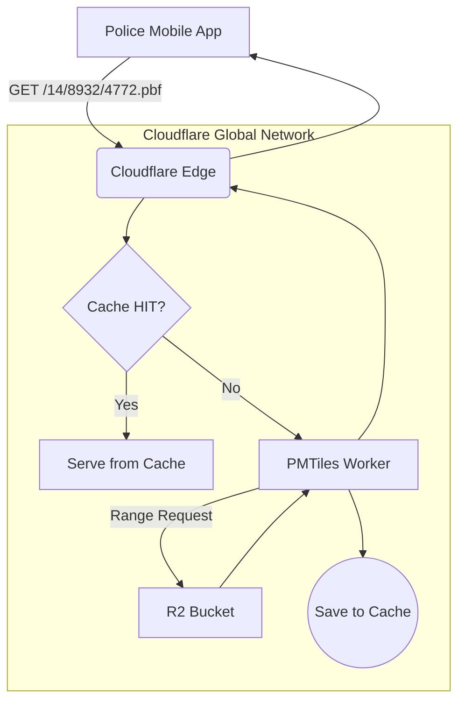

# PMTiles Serverless Worker (Cloudflare)

To serve the tactical map data with maximum performance and minimal cost, Sentinel uses a **Cloudflare Worker** as a serverless tile server. This worker intercepts tile requests, fetches the required data from R2, and leverages Cloudflare's edge cache.

## 1. Architectural Role

The worker acts as a smart "middle-man" between the public internet and the private R2 bucket.


## 2. The `pmtiles` Library & R2 `Source`
The core of the worker is the `pmtiles` JavaScript library. To make this library work with Cloudflare's R2 (which is an object store, not a filesystem), we implement a custom `Source` object.

### The `getBytes` Method
This is the "engine" of the worker. It translates a `pmtiles` request for a specific byte range into a **Cloudflare R2 `range` request**.

```typescript
// in src/index.ts
const source: Source = {
    getKey: () => 'kerala.pmtiles',
    getBytes: async (offset: number, length: number): Promise<RangeResponse> => {
        // This is the key part: we ask R2 for a specific slice of the file
        const object: R2Object | null = await env.BUCKET.get('kerala.pmtiles', {
            range: { offset, length },
        });

        if (!object) {
            throw new Error('Object not found in R2');
        }

        const data = await object.arrayBuffer();
        return { data, etag: object.httpEtag };
    },
};

const p = new PMTiles(source);
```
**Impact:** This ensures that the worker only fetches the tiny piece of the 42MB file that it needs (e.g., a 4KB chunk), making it incredibly fast and efficient.
## 3. Caching Strategy: The "Three Layers"
To ensure sub-50ms latency for patrol units, the worker employs a multi-layered caching strategy.

### Layer 1: Cloudflare Edge Cache (`cache.default`)
*   **Logic:** Before doing any work, the worker checks if the exact request (`/14/8932/4772.pbf`) is already in Cloudflare's edge cache.
*   **Benefit:** If another officer in the same city just viewed the same tile, the response is served instantly from a local Cloudflare data center without ever touching R2 or the worker's CPU.

### Layer 2: `ETag` / Conditional Requests
*   **Logic:** When the worker fetches a byte range from R2, it stores the `etag` (a fingerprint of the data version).
*   **Benefit:** The `pmtiles` library is smart enough to use this. If it needs the same chunk again, it can ask R2 "give me this data *only if* it has changed," saving on R2 read operations.

### Layer 3: Cache Population (`ctx.waitUntil`)
*   **Logic:** After a tile is successfully fetched from R2 (a "Cache MISS"), the worker uses `ctx.waitUntil(cache.put(...))` to save the final response to the Edge Cache.
*   **Benefit:** The next request for this tile will be a "Cache HIT".

## 4. Local Development vs. Production
The worker code includes a critical feature for Senior-level development: **Environment Switching**.
typescript
```
// in src/index.ts
if (env.__env === 'local') {
    // For local dev via `wrangler dev`, use a public URL
    const source = new FetchSource("https://maps.sentinelprod.xyz/kerala.pmtiles");
    p = new PMTiles(source);
} else {
    // For production, use the hyper-efficient R2 bucket binding
    const source = { /* R2 getBytes implementation */ };
    p = new PMTiles(source);
}
```
**Why this is important:**
> This allows developers to test the worker logic locally using `wrangler dev` without needing to constantly upload a new file to R2. It points to a stable "production" URL for local testing, then switches to the optimized R2 binding for deployment.
## 5. Tile Response Logic
*   **Tile Found:** Responds with `200 OK`, the binary tile data, and the correct `Content-Type` and `Content-Encoding` headers.
*   **Tile Not Found (e.g., Ocean):** The `pmtiles` library returns `undefined`. Instead of an error, the worker correctly responds with `204 No Content`. This is the standard Mapbox Tile Spec behavior and prevents the map client from showing an error for empty areas.